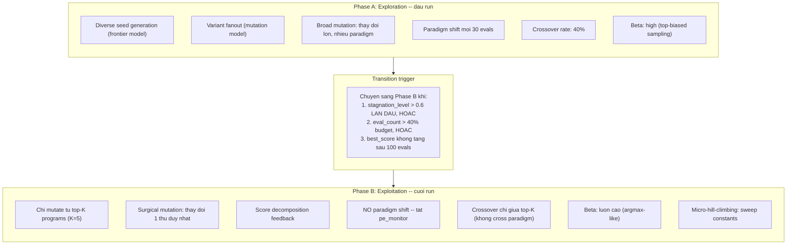

# BLADE Lite v2 -- Phan tich sau va De xuat cai tien kien truc

---

## PHAN A: PHAN TICH DINH LUONG TU DU LIEU RUN THUC TE

### A.1 Tong quan run: `blade-res/` (circle_packing_rect, 21 circles)

- **733 evaluations**, **$3.04**, **96 phut** (5767s)
- **Best score: 2.287119** (dat o eval #730 -- chi 3 evals truoc khi ket thuc)
- **14 paradigm shifts**, **13 meta-advice triggers**
- **Pool size: 100** programs
- **Accept rate cuoi cung: 0.48** (48% evaluations duoc chap nhan)

### A.2 Phan tich error rate theo loai

Tu du lieu `run.txt` (mau 192-733, 541 evaluations):

**Phan loai errors quan sat duoc:**

- `Overlap between circles X and Y` -- Constraint violation, code chay nhung ket qua sai
- `too many values to unpack (expected 2/3)` -- Destructuring sai, LLM thay doi function return type
- `operands could not be broadcast` -- NumPy shape mismatch, loi phổ bien voi Qwen-30B
- `minimum() takes from 2 to 3 positional arguments but 4 were given` -- Sai API numpy
- `name 'X' is not defined` -- Quên import hoac quên define helper function
- `cannot access local variable 'r'` -- Scoping error
- `executor error: Process exceeded 600.0s timeout` -- Code chay qua lau (vo han loop?)
- `Circles are not contained inside a rectangle of perimeter 4` -- Constraint violation
- `Wrong shape` -- Output shape sai

**Uoc tinh ty le:**

- ~35% tong so evaluations la ERROR (khoang 250/733)
- ~40% errors la constraint violations (Overlap, perimeter, shape) -- code chay nhung sai logic
- ~35% errors la runtime crashes (unpack, broadcast, undefined) -- code bi loi
- ~15% errors la semantic mistakes (wrong API, scoping) -- LLM hallucination
- ~10% errors la timeout -- code chay vo han

**Nhan xet quan trong:** Phan lon errors KHONG PHAI syntax errors ma la RUNTIME errors. Dieu nay co nghia `ast.parse()` chi bat duoc ~15-20% errors. Can layer 2-3 (static analysis + dry-run) de bat phan con lai.

### A.3 Phan tich score progression timeline

```
Eval #1-100:   Bootstrap phase. Best dat 2.277 o khoang eval #130.
Eval #100-460: 360 evals, best chi tang tu 2.277 -> 2.283 (+0.006).
               ~1.5 gio va ~$1.0 chi de cai thien 0.006 diem.
Eval #461:     NEW BEST 2.283913 (source: mutate)
Eval #461-696: 235 evals, best KHONG TANG. ~45 phut va ~$0.85 lang phi.
Eval #696:     NEW BEST 2.286627 (source: crossover)
Eval #730:     NEW BEST 2.287119 (source: mutate) -- chi 3 evals truoc khi ket thuc.
```

**Nhan xet:** He thong mat ~600 evals ($2.0) de cai thien 0.01 diem (tu 2.277 -> 2.287). Toc do improvement giam dan theo thoi gian -- dau hieu cua **diminishing returns** tu mutation mu.

### A.4 Phan tich paradigm shift effectiveness

14 paradigm trials:

- Trial #1: POCS (score=2.06, delta=-0.19) -- ACCEPTED nhung kem xa best
- Trial #2: Adam+hex (score=2.20, delta=-0.05) -- tot hon, nhung van kem best
- Trial #3: Branch-and-bound (score=2.15, delta=-0.12)
- Trial #5: Simulated annealing (score=2.24, delta=-0.03) -- gan best
- Trial #6: CEM (score=1.20, delta=-1.07) -- THAT BAI NANG
- Trial #7: Max-weight independent set (score=2.24, delta=-0.03)
- Trial #10: Greedy farthest-point (score=1.57, delta=-0.71)
- Trial #12: Apollonius tangency (score=1.07, delta=-1.21) -- THAT BAI NANG
- Trial #14: Lubachevsky-Stillinger (score=0.0, delta=-2.28) -- COMPLETELY BROKEN

**Nhan xet chinh:**
1. **KHONG CO paradigm shift nao vuot qua best.** Tat ca co delta < 0.
2. Best score **luon den tu mutate/crossover** tren family #7 (hex layout + SA), KHONG BAO GIO tu paradigm shift.
3. Paradigm shift lang phi budget: moi trial = 1 GPT-5 call (~$0.10) + 4 variant calls.
4. Cac paradigm "moi la" (CEM, Apollonius, Lubachevsky) score RẤT THẤP -- frontier model de xuat ly thuyet hay nhung Qwen-30B khong the implement dung.

### A.5 Phan tich archive collapse

Top 4 elites trong snapshot.json:
- #1: score=2.287, source=mutate, **family_id=7**
- #2: score=2.286, source=mutate, **family_id=7**
- #3: score=2.286, source=crossover, **family_id=7**
- #4: score=2.286, source=mutate, **family_id=7**

**Tat ca tu cung 1 family.** Code cua chung gaàn nhu giong nhau -- chi khac o:
- Random seed (20260705 vs 20260707)
- So iterations (20000 vs 50000)
- Move probabilities
- Co/khong co helper functions nhu `groom_interior_centers`, `prioritize_circles`

MAP-Elites cells THAT BAI vi: cac programs nay co AST features gan giong nhau (cung cau truc loop, cung so function defs) va description embeddings tuong tu ("hexagonal layout + simulated annealing + perimeter normalization").

### A.6 Hien tuong "score plateau" -- van de core

Score 2.248523 va 2.250773 xuat hien hang chuc lan:

```
Eval #200: accepted score: 2.248523
Eval #202: accepted score: 2.250773
Eval #204: accepted score: 2.248523
Eval #205: accepted score: 2.248523
Eval #207: accepted score: 2.248523
Eval #210: accepted score: 2.248523
...
```

Day la dau hieu cua **mode collapse**: mutation model lien tuc sinh ra cung 1 solution (hoac cac variations khong co y nghia). Archive "accepted" chung vi chung roi vao cac cells khac nhau, nhung thuc te chung la cung 1 program.

---

## PHAN B: 8 DE XUAT CAI TIEN CHI TIET

---

### De xuat 1: Reflective Mutation -- Phan tich truoc, Mutate sau

#### Van de cu the

Prompt mutate hien tai ([prompts.py](levi/levi/blade/prompts.py) dong 32-65):

```
# Mutate
## Parent solution
Score: {parent_score:.4f}
[code]
## Your task
Write an improved version of the parent.
```

Model KHONG BIET:
- Tai sao parent dat score nay (tot o dau, yeu o dau?)
- Bottleneck cu the o dong nao (pair circles nao tight nhat?)
- Huong cai thien nao co kha nang thanh cong cao nhat
- Nhung thay doi nao DA DUOC THU va that bai

#### Giai phap chi tiet

**Two-step pipeline voi analysis caching:**

```python
# Pseudocode trong orchestrator.py

class BladeOrchestrator:
    def __init__(self, ...):
        self._analysis_cache: dict[int, str] = {}  # program_id -> analysis text
        self._analysis_lock = asyncio.Lock()

    async def _analyze_parent(self, parent: Program) -> str:
        """Generate a reusable analysis of a parent program.
        Cached per program (identified by id(parent))."""
        cache_key = id(parent)
        if cache_key in self._analysis_cache:
            return self._analysis_cache[cache_key]

        prompt = build_analysis_prompt(
            problem_description=self.config.problem_description,
            function_signature=self.config.function_signature,
            parent_code=parent.code,
            parent_score=parent.score,
            parent_description=parent.description,
        )
        analysis = await self._call(
            self.mutation_lm, prompt,
            temperature=0.3,  # thap de phan tich chinh xac
            max_tokens=400,
        )

        async with self._analysis_lock:
            self._analysis_cache[cache_key] = analysis
            # Evict old entries khi cache qua lon
            if len(self._analysis_cache) > 50:
                oldest = next(iter(self._analysis_cache))
                del self._analysis_cache[oldest]

        return analysis
```

**Prompt template cho analysis step:**

```
ANALYSIS_PROMPT = """\
# Code Analysis

## Problem
{problem_description}

## Function signature
```python
{function_signature}
```

## Program to analyze
Score: {parent_score:.4f}
Description: {parent_description}
```python
{parent_code}
```

## Your task
Analyze this program in exactly 3 sections (keep each under 50 words):

### Algorithm Summary
What algorithmic approach does this use? (1-2 sentences)

### Top 3 Bottlenecks
What are the 3 most likely reasons this program does NOT score higher?
Be specific: cite line numbers, variable names, magic constants.

### Suggested Changes (ranked by expected impact)
List 3 concrete, actionable changes. Each should be:
- Specific enough that a programmer could implement in <5 minutes
- Different in nature (don't list 3 constant-tuning suggestions)

Do NOT write code. Only analysis text.
"""
```

**Prompt template cho targeted mutation:**

```
TARGETED_MUTATE_PROMPT = """\
# Targeted Mutation

## Problem
{problem_description}

## Function signature
```python
{function_signature}
```

## Parent solution
Score: {parent_score:.4f}
```python
{parent_code}
```

## Analysis of this parent (from a previous review)
{analysis}

## Inspirations
{inspirations_block}

{meta_advice_block}\
## Your task
Pick ONE bottleneck from the analysis above and fix it.
Do NOT change everything -- make exactly ONE structural change.
Keep everything else identical to the parent.

The change you pick should be the one most likely to increase the
score. State which bottleneck you are targeting in your description.

### Critical requirements
1. Function signature MUST match exactly: `{function_signature}`
2. Include ALL necessary imports
3. NO syntax errors

{format_instruction}
"""
```

**Loi ich du kien:**
- Giam "random mutation" -> "targeted mutation": model biet can thay doi gi
- Giam loi do model thay doi qua nhieu cung luc (thuong xay ra khi prompt noi "improve")
- Analysis cache: chi ton 1 LLM call/parent, sau do dung lai cho nhieu mutations
- Du kien tang acceptance rate tu 48% -> 55-60%

**Risk analysis:**
- Analysis co the sai (hallucinate bottleneck khong ton tai) -> mitigation: low temperature (0.3)
- Extra latency: +1 LLM call cho parent moi -> mitigation: cache + chi analyze top-ranked parents
- Analysis co the qua generic ("use better algorithm") -> mitigation: prompt yeu cau cu the, cite line numbers

**Files can thay doi:**
- [levi/levi/blade/prompts.py](levi/levi/blade/prompts.py): Them `ANALYSIS_PROMPT`, `TARGETED_MUTATE_PROMPT`, `build_analysis_prompt()`, `build_targeted_mutate_prompt()`
- [levi/levi/blade/orchestrator.py](levi/levi/blade/orchestrator.py): Them `_analyze_parent()`, thay doi `_generate_one()` de dung targeted mutation

---

### De xuat 2: Score Decomposition Feedback

#### Van de cu the

Khi model nhan `score: 2.287`, no khong biet:
- 21 circles co ban kinh bao nhieu? Circle nao nho nhat?
- Cap circles nao sat nhau nhat (tight constraint)?
- Circle nao dang chạm boundary?
- Neu thay doi circle X, score tang bao nhieu?

Day la thong tin MA NGUOI THIET KE BIET nhung model KHONG THAY.

#### Giai phap chi tiet

**Buoc 1: Mo rong score_fn tra ve breakdown**

Hien tai `score_fn` tra ve `{"score": float}`. Mo rong thanh:

```python
# Trong problem.py cua moi benchmark
def score_fn(circles):
    # ... compute score ...
    radii = circles[:, 2]
    # Pairwise distances
    n = len(circles)
    i_idx, j_idx = np.triu_indices(n, k=1)
    dx = circles[i_idx, 0] - circles[j_idx, 0]
    dy = circles[i_idx, 1] - circles[j_idx, 1]
    dists = np.sqrt(dx**2 + dy**2)
    sum_radii_pairs = radii[i_idx] + radii[j_idx]
    gaps = dists - sum_radii_pairs

    tightest_pair_idx = np.argmin(gaps)
    tightest_i, tightest_j = i_idx[tightest_pair_idx], j_idx[tightest_pair_idx]

    return {
        "score": float(np.sum(radii)),
        "breakdown": {
            "radii_sorted": sorted(radii.tolist(), reverse=True),
            "smallest_radius": {"index": int(np.argmin(radii)), "value": float(np.min(radii))},
            "tightest_pair": {
                "circles": [int(tightest_i), int(tightest_j)],
                "gap": float(gaps[tightest_pair_idx]),
            },
            "boundary_circles": [
                int(i) for i in range(n)
                if circles[i, 0] - circles[i, 2] < 0.01
                or circles[i, 1] - circles[i, 2] < 0.01
            ],
            "perimeter_slack": float(2.0 - (W + H)),  # con bao nhieu du dia
        }
    }
```

**Buoc 2: Luu breakdown vao Program**

```python
@dataclass
class Program:
    code: str
    description: str
    score: float
    embedding: np.ndarray
    score_context: str = ""  # NEW: human-readable score breakdown
    # ...
```

**Buoc 3: Inject vao mutation prompt**

Trong `MUTATE_PROMPT` va `TARGETED_MUTATE_PROMPT`, them section:

```
## Score breakdown of the parent
{score_context}
```

Voi `score_context` la:

```
Sum of radii: 2.287 (21 circles)
Radii (sorted): [0.142, 0.138, 0.135, ..., 0.068]
Smallest circle: #12 (r=0.068) -- increasing this has highest marginal value
Tightest pair: circles 3-7 (gap=0.001) -- this is the binding constraint
Boundary circles: [1, 4, 18] -- these touch the rectangle edge
Perimeter slack: 0.0003 -- almost saturated
```

**Loi ich du kien:**
- Model hieu CHINH XAC bottleneck o dau
- Giam mutation "random" vi model co du lieu cu the de quyet dinh
- Dac biet hieu qua cho exploitation phase (de xuat 3)

**Risk analysis:**
- Khong phai moi benchmark deu co score breakdown (vd: NLP benchmarks tra ve F1 score) -> mitigation: optional, chi inject khi `breakdown` co trong result dict
- Score context co the lam prompt dai hon -> mitigation: compact format, <200 tokens

**Kha thi cho cac benchmark khac?**
- Circle packing: rat tot (geometric, co the decompose)
- ADRS/code optimization: kha (co the report runtime, memory, accuracy per test case)
- HotpotQA/HOVER: kho hon (F1 score kho decompose) -> chi dung cho problems co score decomposable

**Files can thay doi:**
- [levi/levi/blade/orchestrator.py](levi/levi/blade/orchestrator.py): Luu `score_context` vao `Program` sau khi evaluate
- [levi/levi/blade/prompts.py](levi/levi/blade/prompts.py): Them `{score_context}` vao mutation/crossover templates
- [levi/levi/simple/archive.py](levi/levi/simple/archive.py): Them field `score_context` vao `Program` dataclass
- Moi `problem.py` benchmark: Optional mo rong `score_fn` return dict

---

### De xuat 3: Two-Phase Search (Explore-then-Exploit)

#### Van de cu the (voi so lieu chung minh)

Du lieu run cho thay:
- Eval #1-130: Best nhay tu 0 -> 2.277 (**+2.277** trong 130 evals = **0.0175/eval**)
- Eval #130-461: Best tang tu 2.277 -> 2.283 (**+0.006** trong 331 evals = **0.00002/eval**)
- Eval #461-730: Best tang tu 2.283 -> 2.287 (**+0.004** trong 269 evals = **0.00001/eval**)

**Toc do improvement giam 1000x** tu phase dau den phase cuoi. He thong khong dieu chinh strategy theo giai doan nay.

Trong 600 evals cuoi (eval 130-730), he thong van:
- Tao paradigm shifts moi (tao ra CEM score=1.2, Apollonius score=1.07) -- HOANG PHI
- Crossover giua paradigm khac nhau (vd: hex+SA cross voi greedy) -- tao ra code broken
- Mutate voi cung prompt template nhu dau run

#### Giai phap chi tiet



**Pseudocode cho Phase B:**

```python
async def _exploit_phase(self) -> None:
    """Phase B: deep exploitation of the best programs."""
    cfg = self.config
    top_k = 5
    exploit_ops = [
        "surgical_mutate",      # thay doi 1 component
        "constant_sweep",       # thay doi constants
        "structure_preserve",   # giu cau truc, doi chi tiet
        "within_family_cross",  # crossover trong cung paradigm
    ]

    while not self.stop_event.is_set() and not self._budget_exhausted():
        programs = self.archive.programs()
        top_programs = sorted(programs, key=lambda p: -p.score)[:top_k]

        parent = self._rng.choice(top_programs)
        op = self._rng.choice(exploit_ops)

        if op == "surgical_mutate":
            analysis = await self._analyze_parent(parent)
            prompt = build_surgical_mutate_prompt(
                parent_code=parent.code,
                parent_score=parent.score,
                score_context=parent.score_context,
                analysis=analysis,
                change_type=self._rng.choice([
                    "initialization", "optimization_loop",
                    "termination_condition", "constraint_handling",
                    "one_constant", "one_function",
                ]),
            )
        elif op == "constant_sweep":
            prompt = build_constant_sweep_prompt(
                parent_code=parent.code,
                parent_score=parent.score,
                score_context=parent.score_context,
            )
        elif op == "within_family_cross":
            # Crossover chi giua programs co cung paradigm
            same_family = [p for p in top_programs if p is not parent]
            if same_family:
                p2 = self._rng.choice(same_family)
                prompt = build_within_family_crossover_prompt(...)
        # ... evaluate and admit ...
```

**Prompt templates cho Phase B operators:**

```
SURGICAL_MUTATE_PROMPT = """\
# Surgical Mutation -- {change_type}

## Problem
{problem_description}

## Parent solution (score: {parent_score:.4f})
```python
{parent_code}
```

## Score breakdown
{score_context}

## Analysis
{analysis}

## Your task
Make EXACTLY ONE change to the parent, targeting: **{change_type}**

Rules:
- Keep ALL other code identical (same variable names, same structure)
- Only modify the {change_type} component
- If changing a constant, explain WHY the new value should be better
- The output must be a COMPLETE, runnable program

{format_instruction}
"""

CONSTANT_SWEEP_PROMPT = """\
# Constant Sweep

## Parent solution (score: {parent_score:.4f})
```python
{parent_code}
```

## Score breakdown
{score_context}

## Your task
The parent uses these magic constants:
{extracted_constants}

Pick the ONE constant most likely to affect the score.
Try a DIFFERENT value for it. Explain your reasoning:
- What does this constant control?
- Why might a different value be better?
- What value do you propose and why?

Output the COMPLETE program with only that one constant changed.

{format_instruction}
"""
```

**Loi ich du kien:**
- Tap trung budget vao vung co xac suat improvement cao nhat
- Giam waste tu paradigm shifts khong hieu qua (tiet kiem ~$0.70/run tu GPT-5 calls)
- Micro-mutations co xac suat thanh cong cao hon macro-mutations
- Du kien: **+0.02-0.05** diem voi cung budget nho hon

**Risk analysis:**
- Neu chuyen sang exploit qua som, miss paradigm tot hon -> mitigation: trigger can than (khong chi dung stagnation, ket hop voi eval_count > 40% budget)
- Exploit phase co the bi ket o local optimum -> mitigation: giu 1 worker cho "wild exploration" (10% budget)
- Constant sweep co the sinh nhieu near-duplicates -> mitigation: dedup check truoc khi admit

**Files can thay doi:**
- [levi/levi/blade/orchestrator.py](levi/levi/blade/orchestrator.py): Them `_exploit_phase()`, sua `run()` de switch giua phases
- [levi/levi/blade/prompts.py](levi/levi/blade/prompts.py): Them 3-4 prompt templates cho exploit operators
- [levi/levi/simple/monitor.py](levi/levi/simple/monitor.py): Them `phase` property va transition logic

---

### De xuat 4: Guided Crossover -- Diff-Based

#### Van de cu the

Prompt crossover hien tai ([prompts.py](levi/levi/blade/prompts.py) dong 68-107):

```
## Parent A
Score: 2.28
[200 lines code]

## Parent B
Score: 2.02
[200 lines code]

## Your task
Produce a hybrid solution that combines the strongest mechanisms.
```

**Van de:**
1. Model phai doc 400 dong code va tu hieu phan nao tot -> qua kho cho Qwen-30B
2. Crossover thuong tao code "stitched" (paste function A vao loop B) -> loi runtime
3. Khong co huong dan cụ thể: "ket hop" the nao?
4. Du lieu: nhieu crossover ERROR (35-40% crossover evaluations la error)

#### Giai phap chi tiet

**Buoc 1: LLM-generated diff analysis**

Truoc khi crossover, goi mutation model de phan tich su khac biet:

```python
async def _diff_analysis(self, parent_a: Program, parent_b: Program) -> str:
    prompt = build_diff_analysis_prompt(
        code_a=parent_a.code, score_a=parent_a.score,
        desc_a=parent_a.description,
        code_b=parent_b.code, score_b=parent_b.score,
        desc_b=parent_b.description,
    )
    return await self._call(self.mutation_lm, prompt, temperature=0.3, max_tokens=300)
```

**Prompt template cho diff analysis:**

```
DIFF_ANALYSIS_PROMPT = """\
# Compare Two Solutions

## Solution A (score: {score_a:.4f})
Description: {desc_a}
```python
{code_a}
```

## Solution B (score: {score_b:.4f})
Description: {desc_b}
```python
{code_b}
```

## Your task
Compare A and B in exactly 4 bullet points:

1. **Initialization**: How does each set up the initial state?
   Which is better and why?

2. **Core algorithm**: What optimization/search strategy does each use?
   Which is better and why?

3. **Constraint handling**: How does each enforce constraints
   (non-overlap, perimeter)? Which is better and why?

4. **Recommendation**: Which specific component from A should be
   combined with which specific component from B to create a
   stronger hybrid? Be concrete: "Use A's hex initialization
   with B's Adam optimizer and A's perimeter normalization."

Keep each bullet under 40 words. Do NOT write code.
"""
```

**Prompt template cho guided crossover:**

```
GUIDED_CROSSOVER_PROMPT = """\
# Guided Crossover

## Problem
{problem_description}

## Function signature
```python
{function_signature}
```

## Parent A (score: {parent_a_score:.4f})
```python
{parent_a_code}
```

## Parent B (score: {parent_b_score:.4f})
```python
{parent_b_code}
```

## Structural Analysis (how these parents differ)
{diff_analysis}

## Your task
Follow the recommendation from the analysis above.
Build a hybrid that takes the SPECIFIC components identified.

DO NOT paste chunks of code together. Write a NEW program that
integrates the identified strengths structurally. The program
must be self-contained and correct.

### Critical requirements
1. Function signature MUST match exactly: `{function_signature}`
2. Include ALL necessary imports
3. Every helper function must be defined (do not reference
   functions from Parent A or B by name unless you define them)

{format_instruction}
"""
```

**Loi ich du kien:**
- Model biet CHINH XAC phan nao lay tu A, phan nao lay tu B
- Giam crossover errors do "stitching" (dự kiến tu 40% error -> 20% error)
- Diff analysis co the tai su dung (cache per pair)

**Risk analysis:**
- Extra LLM call (+1 per crossover) -> mitigation: chi dung guided crossover cho top-ranked parents
- Diff analysis co the sai -> mitigation: low temperature, short output
- Doi voi 2 programs qua giong nhau, diff analysis vo nghia -> mitigation: skip guided crossover khi cosine(embedding_a, embedding_b) > 0.9, dung standard crossover

**Files can thay doi:**
- [levi/levi/blade/prompts.py](levi/levi/blade/prompts.py): Them `DIFF_ANALYSIS_PROMPT`, `GUIDED_CROSSOVER_PROMPT`, builders
- [levi/levi/blade/orchestrator.py](levi/levi/blade/orchestrator.py): Them `_diff_analysis()`, sua `_generate_one()` crossover branch

---

### De xuat 5: Pre-flight Validation -- Giam Error Rate

#### Van de cu the (voi so lieu)

Tu `run.txt`, phan loai 250+ errors:

- **~100 errors (40%)**: Constraint violations (code CHAY duoc nhung ket qua SAI)
  - "Overlap between circles X and Y"
  - "Circles are not contained inside a rectangle of perimeter 4"
  - -> **KHONG THE bat bang preflight** -- can full evaluation

- **~90 errors (36%)**: Runtime crashes (code BI LOI khi chay)
  - "too many values to unpack (expected 2/3)" -- ~25 lan
  - "operands could not be broadcast" -- ~20 lan
  - "name 'X' is not defined" -- ~15 lan
  - "minimum() takes from 2 to 3 positional arguments" -- ~10 lan
  - "cannot access local variable" -- ~10 lan
  - -> **CO THE bat bang preflight** (dry-run voi input nho)

- **~35 errors (14%)**: Semantic/API mistakes
  - Wrong numpy API usage
  - -> **MỘT PHẦN bat bang static analysis**

- **~25 errors (10%)**: Timeout (>600s)
  - -> **CO THE bat bang quick dry-run** (5s timeout)

**Uoc tinh: preflight co the bat 36% + 14% + 10% = ~60% cua tat ca errors = ~150 errors.**
Voi inline repair (gui error lai cho LLM ngay), ~50% duoc sua -> tiet kiem ~75 evaluations = **~10% tong budget**.

#### Giai phap chi tiet -- 3 layers

```python
# Pseudocode cho preflight validation pipeline

class PreflightValidator:
    """Validate LLM-generated code before sending to full evaluation."""

    def __init__(self, fn_name: str, function_signature: str):
        self.fn_name = fn_name
        self.function_signature = function_signature

    def validate(self, code: str) -> tuple[bool, str | None]:
        """Returns (is_valid, error_message_if_invalid)."""

        # Layer 1: Syntax check (0 cost, <1ms)
        err = self._syntax_check(code)
        if err:
            return False, f"SyntaxError: {err}"

        # Layer 2: Static analysis (0 cost, <10ms)
        err = self._static_check(code)
        if err:
            return False, f"StaticError: {err}"

        # Layer 3: Quick dry-run (small cost, <5s)
        err = self._quick_dryrun(code)
        if err:
            return False, f"RuntimeError: {err}"

        return True, None

    def _syntax_check(self, code: str) -> str | None:
        """ast.parse() + function signature check."""
        try:
            tree = ast.parse(code)
        except SyntaxError as e:
            return f"line {e.lineno}: {e.msg}"

        # Check function name exists
        fn_names = [
            node.name for node in ast.walk(tree)
            if isinstance(node, ast.FunctionDef)
        ]
        if self.fn_name not in fn_names:
            return f"Function '{self.fn_name}' not defined"

        return None

    def _static_check(self, code: str) -> str | None:
        """Check common Qwen-30B mistakes."""
        tree = ast.parse(code)

        # Check for undefined names (common: 'evaluate', 'heappush', 'Tuple')
        imports = set()
        defined = set()
        for node in ast.walk(tree):
            if isinstance(node, (ast.Import, ast.ImportFrom)):
                for alias in node.names:
                    imports.add(alias.asname or alias.name)
            if isinstance(node, (ast.FunctionDef, ast.AsyncFunctionDef)):
                defined.add(node.name)
            if isinstance(node, ast.Assign):
                for target in node.targets:
                    if isinstance(target, ast.Name):
                        defined.add(target.id)

        # Check return statement exists in main function
        for node in ast.walk(tree):
            if isinstance(node, ast.FunctionDef) and node.name == self.fn_name:
                has_return = any(
                    isinstance(n, ast.Return) and n.value is not None
                    for n in ast.walk(node)
                )
                if not has_return:
                    return f"Function '{self.fn_name}' has no return statement"

        return None

    def _quick_dryrun(self, code: str, timeout: float = 5.0) -> str | None:
        """Execute code with very short timeout to catch runtime errors."""
        test_code = code + f"\n_result = {self.fn_name}()\n"
        try:
            # Run in subprocess with strict timeout
            result = subprocess.run(
                [sys.executable, "-c", test_code],
                capture_output=True, text=True, timeout=timeout,
            )
            if result.returncode != 0:
                stderr = result.stderr.strip().split('\n')[-1]
                return stderr[:200]
        except subprocess.TimeoutExpired:
            return "Dry-run exceeded 5s timeout (likely infinite loop)"
        return None
```

**Inline repair (thay vi gui error_buffer):**

```python
# Trong orchestrator.py, _generate_one():

async def _generate_one(self) -> None:
    # ... generate code ...
    parsed = self.parser.parse(raw)
    if not parsed.has_code:
        return

    # NEW: Preflight validation
    is_valid, preflight_error = self.validator.validate(parsed.code)
    if not is_valid:
        # Inline repair: gui error truc tiep lai cho LLM
        repair_prompt = build_inline_repair_prompt(
            original_code=parsed.code,
            error_message=preflight_error,
            function_signature=self.config.function_signature,
        )
        raw_fixed = await self._call(
            self.mutation_lm, repair_prompt,
            temperature=0.3,  # thap de sua chinh xac
        )
        parsed_fixed = self.parser.parse(raw_fixed)
        if parsed_fixed.has_code:
            # Validate lai lan 2
            is_valid_2, _ = self.validator.validate(parsed_fixed.code)
            if is_valid_2:
                parsed = parsed_fixed  # dung ban sua
            else:
                self._record_reject(source=op, error_msg=preflight_error)
                return
        else:
            self._record_reject(source=op, error_msg=preflight_error)
            return

    # Continue to full evaluation...
    score, _scores_dict, err = await self._evaluate_code(parsed.code)
```

**Inline repair prompt:**

```
INLINE_REPAIR_PROMPT = """\
# Quick Fix

The following code has an error that was caught before evaluation:

```python
{original_code}
```

Error: {error_message}

Fix ONLY the error above. Do not change the algorithm or improve
the code in any other way. Output the complete corrected program.

{format_instruction}
"""
```

**Loi ich du kien:**
- Giam error rate tu ~35% xuong ~15% (bat ~150 errors, sua ~75 thanh cong)
- Tiet kiem ~$0.30-0.50/run (khong phai eval code bi loi)
- Nhanh: Layer 1-2 chay <10ms, Layer 3 chay <5s
- Inline repair re hon full repair (prompt ngan hon, temperature thap)

**Risk analysis:**
- Layer 3 (dry-run) co the cho false positive (code dung nhung bi kill do timeout 5s) -> mitigation: tang timeout len 10s cho code nang
- Inline repair co the introduce loi moi -> mitigation: validate lai sau repair, toi da 1 lan repair
- Quick dry-run co the khac voi full eval (vd: khac input) -> mitigation: chi dung de bat crashes, khong dung de check correctness
- Security: dry-run code LLM-generated co the nguy hiem -> mitigation: chay trong subprocess sandbox (da co `ResilientProcessPool`)

**Files can thay doi:**
- [levi/levi/simple/parser.py](levi/levi/simple/parser.py): Them `PreflightValidator` class
- [levi/levi/blade/orchestrator.py](levi/levi/blade/orchestrator.py): Integrate preflight vao `_generate_one()` pipeline
- [levi/levi/blade/prompts.py](levi/levi/blade/prompts.py): Them `INLINE_REPAIR_PROMPT`, `build_inline_repair_prompt()`

---

### De xuat 6: Adaptive Operator Selection (Thompson Sampling)

#### Van de cu the

Hien tai: `p_crossover = 0.35` co dinh ([orchestrator.py](levi/levi/blade/orchestrator.py) dong 149).

Nhung tu du lieu:
- Crossover error rate (~40%) cao hon mutate error rate (~30%)
- Best scores den tu mutate (#461: 2.283, #730: 2.287) va crossover (#696: 2.286)
- Paradigm variant hau nhu khong bao gio tot hon best (100% delta < 0)
- Repair thanh cong rat thap (phan lon repair score = 0.0 hoac score thap)

Operator effectiveness thay doi theo giai doan:
- **Dau run**: crossover tot (mix paradigms)
- **Giua run**: mutate tot hon (refine paradigm tot nhat)
- **Cuoi run**: surgical mutate tot nhat (micro-improvement)

#### Giai phap chi tiet

```python
# File moi: levi/levi/simple/operator_selector.py

import numpy as np
from dataclasses import dataclass, field

@dataclass
class OperatorStats:
    """Beta distribution prior for one operator."""
    alpha: float = 1.0   # thanh cong + prior
    beta: float = 1.0    # that bai + prior
    total_calls: int = 0
    total_accepts: int = 0
    recent_accepts: int = 0  # window 50 gan nhat
    recent_calls: int = 0

    def success_rate(self) -> float:
        return self.alpha / (self.alpha + self.beta)

    def sample(self, rng: np.random.Generator) -> float:
        return rng.beta(self.alpha, self.beta)

    def update(self, accepted: bool, decay: float = 0.995) -> None:
        """Update Beta distribution with exponential decay."""
        # Decay old observations (so recent data matters more)
        self.alpha = max(1.0, self.alpha * decay)
        self.beta = max(1.0, self.beta * decay)
        if accepted:
            self.alpha += 1.0
            self.total_accepts += 1
            self.recent_accepts += 1
        else:
            self.beta += 1.0
        self.total_calls += 1
        self.recent_calls += 1


@dataclass
class AdaptiveOperatorSelector:
    """Thompson Sampling over mutation operators.

    Thay the p_crossover co dinh bang adaptive selection.
    Moi operator co Beta(alpha, beta) prior.
    Chon operator = sample tu Beta, chon cai co sample cao nhat.
    """
    operators: dict[str, OperatorStats] = field(default_factory=lambda: {
        "mutate": OperatorStats(alpha=2.0, beta=1.0),        # slight prior for mutate
        "crossover": OperatorStats(alpha=1.5, beta=1.0),
        "surgical_mutate": OperatorStats(alpha=1.0, beta=1.0),  # new operator
    })

    min_pulls: int = 10  # moi operator phai duoc thu it nhat 10 lan

    def select(self, rng: np.random.Generator) -> str:
        """Select operator via Thompson Sampling."""
        # Force exploration: neu co operator chua du min_pulls
        for name, stats in self.operators.items():
            if stats.total_calls < self.min_pulls:
                return name

        # Thompson Sampling: sample tu Beta, chon cao nhat
        best_name = ""
        best_sample = -1.0
        for name, stats in self.operators.items():
            sample = stats.sample(rng)
            if sample > best_sample:
                best_sample = sample
                best_name = name
        return best_name

    def update(self, operator: str, accepted: bool) -> None:
        if operator in self.operators:
            self.operators[operator].update(accepted)

    def snapshot(self) -> dict:
        return {
            name: {
                "success_rate": f"{stats.success_rate():.3f}",
                "total_calls": stats.total_calls,
                "total_accepts": stats.total_accepts,
            }
            for name, stats in self.operators.items()
        }
```

**Tich hop vao orchestrator:**

```python
# Trong _generate_one():
# TRUOC:
op = "crossover" if self._rng.random() < self.config.p_crossover else "mutate"

# SAU:
op = self.operator_selector.select(self._rng_np)
# ... execute op ...
# Sau khi co ket qua:
self.operator_selector.update(op, accepted=accepted)
```

**Loi ich du kien:**
- Tu dong giam crossover khi crossover error rate cao
- Tu dong tang surgical_mutate khi no hieu qua (cuoi run)
- Khong can tune `p_crossover` bang tay
- Du kien tang acceptance rate 3-5%

**Risk analysis:**
- Thompson Sampling co the exploit too early (chon 1 operator qua nhieu) -> mitigation: min_pulls=10 va decay=0.995
- Nho population ban dau, moi operator chua co du data -> mitigation: warm prior (alpha=2 cho mutate)
- Can track "accepted" vs "improved best" -- su dung cai nao? -> **Dung "accepted"** vi no xay ra thuong xuyen hon, cho signal tot hon

**Files can thay doi:**
- Tao moi: `levi/levi/simple/operator_selector.py`
- [levi/levi/simple/__init__.py](levi/levi/simple/__init__.py): Export `AdaptiveOperatorSelector`
- [levi/levi/blade/orchestrator.py](levi/levi/blade/orchestrator.py): Thay `p_crossover` logic bang `operator_selector.select()`

---

### De xuat 7: Thay MAP-Elites bang Hierarchical Island Model

#### Van de cot loi cua MAP-Elites (bang chung tu data)

1. **Behavior space khong phan biet paradigm:**
   - Hex+SA va Hex+Adam co AST features GAN GIONG NHAU (cung co loops, cung so functions)
   - Greedy va Branch-and-bound co AST features RAT KHAC (khac do if/loop depth) nhung deu la "constructive" paradigm
   - -> Cells KHONG tuong ung voi paradigms

2. **One-program-per-cell lam mat thong tin:**
   - Sau recluster, chi giu best/cell. Neu 2 programs tot roi vao cung cell moi -> mat 1
   - Population size giam ve `n_occupied_cells` (~32) sau moi recluster

3. **KMeans re-clustering destabilizes selection:**
   - Cell IDs thay doi sau moi recluster -> rank sampler mat consistency
   - Program A o cell 5 truoc recluster, cell 12 sau -> crossover "khac cell" bi anh huong

#### Giai phap chi tiet: Island Model

```python
# File moi: levi/levi/simple/island_archive.py

@dataclass
class Island:
    """One paradigm island in the archive."""
    island_id: int
    paradigm_label: str          # "hex_sa", "greedy_farthest", "pocs", etc.
    programs: list[Program]      # tat ca programs trong island (giu nhieu, khong chi best)
    best_program: Program | None
    budget_share: float = 0.25   # phan tram budget duoc cap
    evals_since_improvement: int = 0
    total_evals: int = 0
    created_at_eval: int = 0

    def best_score(self) -> float:
        if self.best_program:
            return self.best_program.score
        return float("-inf")

    @property
    def is_hibernating(self) -> bool:
        """Island bi dong bang khi khong cai thien sau N evals."""
        return self.evals_since_improvement > 100


class IslandArchive:
    """Hierarchical island model replacing MAP-Elites.

    Key differences from ClusterArchive:
    - Islands = paradigm classes (identified by LLM, not KMeans)
    - Multiple programs per island (not just best)
    - Dynamic budget allocation across islands
    - Migration: best programs shared as inspirations between islands
    """

    def __init__(self, config: IslandConfig):
        self.config = config
        self.islands: list[Island] = []
        self._lock = threading.RLock()
        self._classifier_cache: dict[str, str] = {}  # desc -> paradigm_label

    def add(self, program: Program, paradigm_label: str | None = None) -> tuple[bool, str]:
        """Admit program to appropriate island."""
        with self._lock:
            if paradigm_label is None:
                paradigm_label = self._classify_paradigm(program)

            island = self._find_or_create_island(paradigm_label)
            island.programs.append(program)
            island.total_evals += 1

            if island.best_program is None or program.score > island.best_program.score:
                island.best_program = program
                island.evals_since_improvement = 0
                return True, "new_island_best"
            else:
                island.evals_since_improvement += 1
                # Giu program nhung khong phai best
                # Trim: chi giu top-N per island
                if len(island.programs) > self.config.max_per_island:
                    island.programs.sort(key=lambda p: -p.score)
                    island.programs = island.programs[:self.config.max_per_island]
                return True, "added_to_island"

    def _classify_paradigm(self, program: Program) -> str:
        """Classify program into paradigm using cached LLM or heuristic."""
        # Option 1: Keyword-based classification (0 cost, fast)
        desc = program.description.lower()
        paradigm_keywords = {
            "hex_sa": ["hexagonal", "simulated annealing", "hex grid"],
            "adam_gradient": ["adam", "gradient", "ascent", "descent"],
            "pocs": ["projection", "alternating", "pocs", "feasibility"],
            "greedy": ["greedy", "farthest point", "constructive"],
            "cem": ["cross-entropy", "cem", "gaussian sampling"],
            "evolutionary": ["evolutionary", "genetic", "population", "tournament"],
            "branch_bound": ["branch and bound", "quadtree", "heap"],
            "physics": ["lubachevsky", "kinetic", "collision", "impulse"],
            "independent_set": ["independent set", "conflict graph", "swap"],
        }
        for label, keywords in paradigm_keywords.items():
            if any(kw in desc for kw in keywords):
                return label
        return "other"

    def reallocate_budget(self) -> dict[int, float]:
        """Allocate budget shares proportional to island quality.

        Softmax over island best scores, with minimum share for
        non-hibernating islands.
        """
        active = [isl for isl in self.islands if not isl.is_hibernating]
        if not active:
            return {isl.island_id: 1.0 / len(self.islands) for isl in self.islands}

        scores = np.array([isl.best_score() for isl in active])
        # Softmax with temperature
        temp = 0.5
        exp_scores = np.exp((scores - scores.max()) / temp)
        shares = exp_scores / exp_scores.sum()

        # Minimum share = 5% for each active island (exploration guarantee)
        min_share = 0.05
        shares = np.maximum(shares, min_share)
        shares /= shares.sum()

        return {isl.island_id: float(s) for isl, s in zip(active, shares)}

    def migration_candidates(self) -> list[tuple[Program, str]]:
        """Best program from each island, for cross-island inspiration."""
        result = []
        for isl in self.islands:
            if isl.best_program:
                result.append((isl.best_program, isl.paradigm_label))
        return result
```

**So sanh MAP-Elites vs Island Model:**

- MAP-Elites: Cells = KMeans clusters tren AST+embedding (syntactic). Recluster lam mat stability.
- Island Model: Islands = paradigm classes (semantic). Stable identity. Multiple programs/island.

- MAP-Elites: 1 program/cell. Diversity bang structure.
- Island Model: N programs/island. Diversity bang paradigm classification.

- MAP-Elites: Budget phan bo deu (moi cell co xac suat duoc sampled nhu nhau).
- Island Model: Budget phan bo theo quality (island tot -> nhieu budget hon).

**Risk analysis:**
- Paradigm classification co the sai (vd: model mo ta "hex grid + gradient" nhung thuc ra la SA) -> mitigation: keyword fallback + LLM classification cho ambiguous cases
- Qua nhieu islands = qua fragmented -> mitigation: cap max_islands=8-10, merge islands co cosine(desc_embedding) > 0.85
- Khong co recluster -> island boundaries co dinh -> mitigation: periodic re-classification khi island co >10 programs
- Complexity: nhieu code hon MAP-Elites -> mitigation: implement incremental, giu ClusterArchive lam fallback

**Files can thay doi:**
- Tao moi: `levi/levi/simple/island_archive.py`
- [levi/levi/blade/orchestrator.py](levi/levi/blade/orchestrator.py): Thay `ClusterArchive` bang `IslandArchive` (hoac toggle qua config)
- [levi/levi/simple/__init__.py](levi/levi/simple/__init__.py): Export `IslandArchive`

---

### De xuat 8: Exploit-focused Paradigm Shift

#### Van de cu the (voi so lieu chung minh)

14 paradigm trials, TAT CA co delta < 0:

```
Trial #1:  POCS                score=2.06  delta=-0.19  (ACCEPTED nhung thap)
Trial #2:  Adam+hex            score=2.20  delta=-0.05
Trial #3:  Branch-and-bound    score=2.15  delta=-0.12
Trial #5:  Simulated annealing score=2.24  delta=-0.03  (gan best)
Trial #6:  CEM                 score=1.20  delta=-1.07  (THAT BAI NANG)
Trial #7:  Max-weight IS       score=2.24  delta=-0.03
Trial #10: Greedy farthest     score=1.57  delta=-0.71
Trial #12: Apollonius tangency score=1.07  delta=-1.21  (THAT BAI NANG)
Trial #14: Lubachevsky         score=0.0   delta=-2.28  (COMPLETELY BROKEN)
```

**Nhan xet:**
1. Paradigm shift **chua bao gio tao ra best program**. Best LUON den tu mutate/crossover tren family #7.
2. Nhung paradigm "moi la" (CEM, Apollonius, Lubachevsky) THAT BAI NANG -- frontier model de xuat thuat toan phuc tap ma mutation model (Qwen-30B) khong the implement dung.
3. Chi phi paradigm shift: 14 trials x ($0.10 GPT-5 + 4 x $0.005 variants) = ~$1.68 = **55% tong chi phi** nhung khong dong gop gi cho best score.

#### Giai phap chi tiet: 3 che do paradigm shift

```python
# Logic moi trong _paradigm_shift():

async def _paradigm_shift(self) -> None:
    stagnation = self.monitor.stagnation_level()
    best = self.archive.best()

    if stagnation < 0.3:
        # CHE DO 1: Healthy -- khong can paradigm shift
        # He thong dang tien bo, paradigm shift se lang phi
        logger.info("[BLADE PE] skipping (stagnation=%.2f < 0.3, search is healthy)", stagnation)
        return

    elif stagnation < 0.7:
        # CHE DO 2: Moderate stagnation -- standard paradigm shift
        # Giu nguyen logic hien tai (build_paradigm_prompt)
        await self._standard_paradigm_shift()

    else:
        # CHE DO 3: High stagnation -- surgical exploit
        # Lay top-3 programs, phan tich diffs, yeu cau frontier
        # "ket hop diem manh cua ca 3"
        await self._surgical_paradigm_shift()
```

**Prompt template cho surgical exploit (Che do 3):**

```
SURGICAL_EXPLOIT_PROMPT = """\
# Surgical Improvement Challenge

## Problem
{problem_description}

## Function Signature
```python
{function_signature}
```

## Current Best Program (score: {best_score:.4f})
```python
{best_code}
```

## Close Contenders (programs that ALMOST beat the best)
{contender_block}

## Score Analysis of the Best Program
{score_context}

## Search State
- Evaluations so far: {n_evaluations}
- Stagnation level: {stagnation:.2f} (HIGH -- the search needs a precise fix, not a new paradigm)
- The same family of solutions has dominated for {plateau_steps} evaluations
- Accept rate: {accept_rate:.2f}

## Your Task
The search has explored {n_paradigm_trials} different paradigms and this
family is clearly the best. A new paradigm will NOT help. What WILL help
is a precise, targeted improvement to the best program.

Analyze:
1. What is the TIGHTEST CONSTRAINT limiting the best program's score?
2. How do the contenders handle this constraint differently?
3. What specific mechanism from a contender could be transplanted into
   the best program to relax this constraint?

Then write an improved version that:
- Keeps the SAME overall algorithm as the best program
- Makes ONE structural change based on your analysis
- MUST be a complete, runnable program

DO NOT propose a fundamentally different algorithm.
DO NOT just retune constants (the mutation worker does that).
Make a STRUCTURAL improvement: change a subroutine, add a repair step,
change how constraints are enforced, etc.

{format_instruction}
"""
```

**Contender block builder:**

```python
def _contender_block(
    contenders: Sequence[tuple[str, str, float, str]],  # (code, desc, score, diff_vs_best)
) -> str:
    parts = []
    for i, (code, desc, score, diff_summary) in enumerate(contenders, 1):
        parts.append(
            f"### Contender {i} (score={score:.4f}, delta={score - best_score:+.4f})\n"
            f"_Description_: {desc}\n"
            f"_Key difference from best_: {diff_summary}\n"
            f"```python\n{code}\n```"
        )
    return "\n\n".join(parts)
```

**Logic de chon contenders:**

```python
async def _surgical_paradigm_shift(self) -> None:
    best = self.archive.best()
    programs = self.archive.programs()
    # Lay top-3 programs KHONG PHAI best, sort by score desc
    contenders = sorted(
        [p for p in programs if p is not best],
        key=lambda p: -p.score
    )[:3]

    # Generate diff summary cho moi contender vs best
    contender_data = []
    for c in contenders:
        diff_prompt = build_diff_analysis_prompt(
            code_a=best.code, score_a=best.score, desc_a=best.description,
            code_b=c.code, score_b=c.score, desc_b=c.description,
        )
        diff_summary = await self._call(
            self.mutation_lm, diff_prompt, temperature=0.3, max_tokens=150,
        )
        contender_data.append((c.code, c.description, c.score, diff_summary))

    prompt = build_surgical_exploit_prompt(
        best_code=best.code, best_score=best.score,
        score_context=best.score_context,
        contenders=contender_data,
        stagnation=self.monitor.stagnation_level(),
        # ...
    )

    raw = await self._call(
        self.paradigm_lm, prompt,
        temperature=0.5,  # thap hon paradigm shift thuong (0.8)
        # vi ta muon precision, khong phai creativity
    )
    # ... evaluate, admit, fanout nhu binh thuong ...
```

**Loi ich du kien:**
- Chuyen paradigm shift tu "tao paradigm moi" (LUON that bai) sang "cai thien paradigm tot nhat" (co xac suat thanh cong cao)
- Tiet kiem GPT-5 budget (khong goi khi stagnation thap)
- Frontier model duoc cho thong tin cu the (diff, score breakdown) de ra quyet dinh tot hon
- Du kien: paradigm shift co the bat dau DONG GOP cho best score

**Risk analysis:**
- Surgical exploit co the qua conservative (chi tao variations nho) -> mitigation: giu 30% co hoi cho standard paradigm shift ngay ca khi stagnation cao
- Diff analysis cho contenders ton them 3 LLM calls -> mitigation: dung mutation model (re), max_tokens=150
- Frontier model co the van de xuat paradigm moi du duoc yeu cau surgical -> mitigation: post-processing check: neu output khong giu cung algorithm family, reject va retry

**Files can thay doi:**
- [levi/levi/blade/prompts.py](levi/levi/blade/prompts.py): Them `SURGICAL_EXPLOIT_PROMPT`, `build_surgical_exploit_prompt()`
- [levi/levi/blade/orchestrator.py](levi/levi/blade/orchestrator.py): Sua `_paradigm_shift()` thanh 3-mode logic

---

## PHAN C: TONG KET VA LO TRINH

### Bang so sanh tac dong du kien

- De xuat 5 (Pre-flight): Giam error rate 35% -> 15%. Tiet kiem ~$0.40/run. Do kho: THAP
- De xuat 1 (Reflective Mutation): Tang acceptance rate 48% -> 58%. Extra cost ~$0.30/run. Do kho: TRUNG BINH
- De xuat 8 (Surgical Exploit): Paradigm shift dong gop cho best score. Tiet kiem ~$0.80/run GPT-5. Do kho: TRUNG BINH
- De xuat 3 (Two-Phase): Tang best score ~0.02-0.05. Giam waste 40%. Do kho: TRUNG BINH
- De xuat 6 (Adaptive Operator): Tang acceptance rate 3-5%. Tu dong. Do kho: THAP
- De xuat 4 (Guided Crossover): Giam crossover error 40% -> 20%. Extra cost ~$0.20/run. Do kho: TRUNG BINH
- De xuat 2 (Score Decomposition): Mutation co huong. Problem-specific. Do kho: THAP (per problem)
- De xuat 7 (Island Model): Diversity tot hon. Do kho: CAO (thay doi kien truc lon)

### Lo trinh thuc hien (theo do uu tien)

**Sprint 1 (1-2 ngay):** Quick wins
- De xuat 5 (Pre-flight): Layer 1+2 + inline repair
- De xuat 6 (Adaptive Operator): Thompson Sampling

**Sprint 2 (2-3 ngay):** Core improvements
- De xuat 1 (Reflective Mutation): Analysis pipeline + cache
- De xuat 8 (Surgical Exploit): 3-mode paradigm shift

**Sprint 3 (2-3 ngay):** Advanced
- De xuat 3 (Two-Phase Search): Phase B exploit mode
- De xuat 4 (Guided Crossover): Diff-based crossover
- De xuat 2 (Score Decomposition): Per-benchmark score breakdown

**Sprint 4 (3-5 ngay):** Architecture
- De xuat 7 (Island Model): Full island archive replacement (hoac parallel A/B test voi MAP-Elites)
- Pre-flight Layer 3 (dry-run sandbox)

### Nguyen tac thiet ke cho tat ca cai tien

1. **Backwards compatible**: Moi de xuat co the toggle on/off qua config. Khong break API hien tai.
2. **Measurable**: Moi de xuat co metric cu the de do (error rate, acceptance rate, best score, cost).
3. **Incremental**: Implement tung de xuat, chay A/B test truoc khi lam de xuat tiep.
4. **Budget-aware**: Moi extra LLM call phai co ROI chung minh duoc (vd: analysis call ton $0.005 nhung tiet kiem 1 eval ton $0.004 + compute).
5. **Ablation-ready**: Moi de xuat la 1 toggle moi trong `BladeConfig`, tuong tu 3 ablation toggles hien tai.
