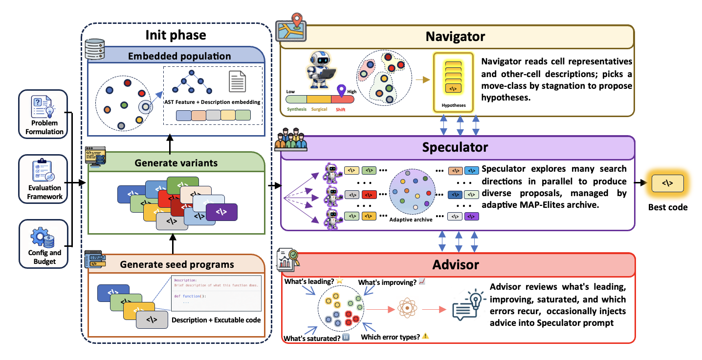
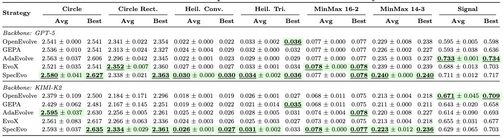
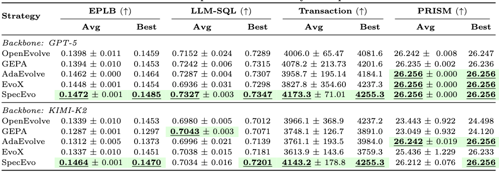
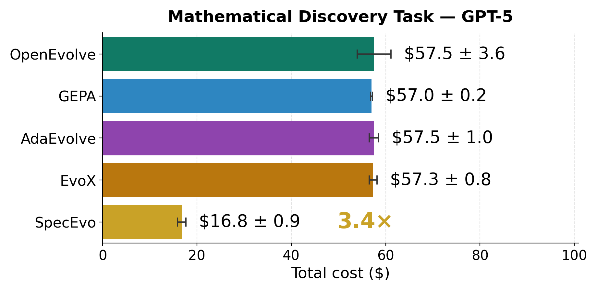
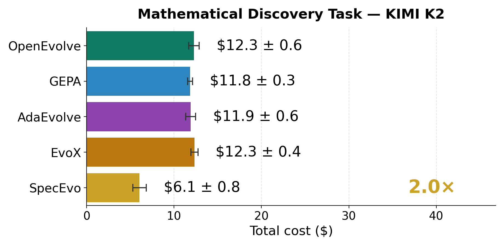
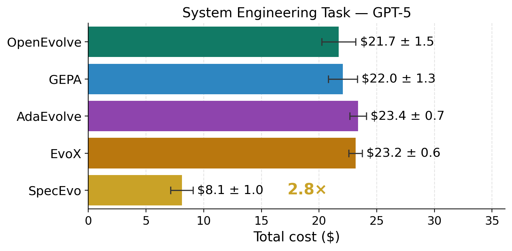
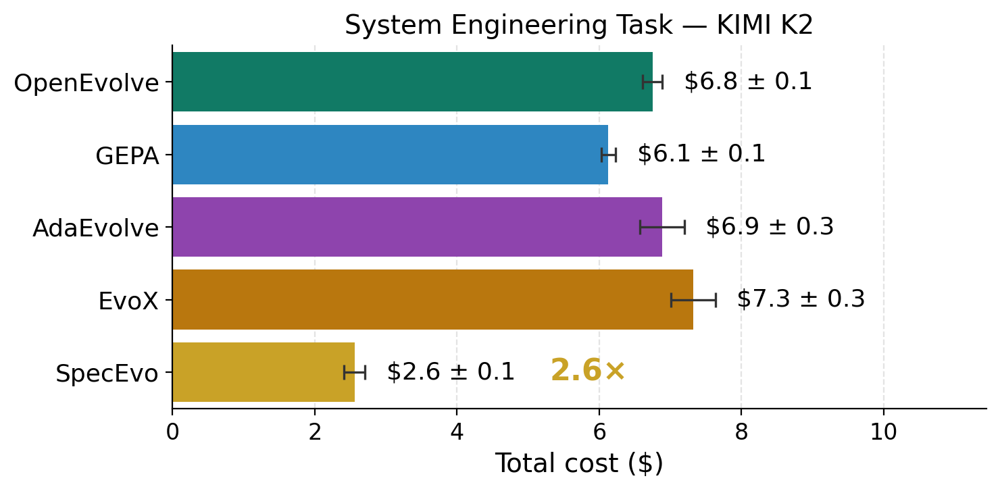

# SpecEvo: Speculative Evolution with Large Language Models for Cost-Efficient Scientific Discovery

**Operating loop: Speculate → Navigate → Advise.**

---

## Abstract

LLM-driven evolutionary search is powerful but expensive, paying twice over — in **dollars and in
time** — because a single frontier model is asked to carry every step. That one decision forces a bad
trade: run the model sequentially and the search is slow to find its footing under a budget; run it in
parallel and the cost explodes. SpecEvo breaks the trade by noticing that the two regimes have different
natural owners — *breadth is cheap and parallel, while depth is expensive and sequential* — so a small,
fast **Speculator** explores many directions at once into a self-organizing behavioral archive, while a
frontier **Navigator** is woken only for the rare, hard step. This split pays off only if the cheap
swarm is productive, which is what the rest of the design secures: because discovery is a
*generate-then-reflect* process, the Speculator's value is as much the evidence it leaves behind as the
wins it scores, and the Navigator reads the accumulated archive as a *map* to propose a directed move
(one of three classes, escalating with stagnation) rather than another blind edit. To keep the swarm
productive in the first place, SpecEvo steers it instead of repeating an "improve this" prompt — distinct
exploration operators force it to cover the space, and an **Advisor** turns the whole trajectory,
including the failures and near-misses a scalar score discards, into concise natural-language feedback
that flows back into the Speculator.

Across mathematical-discovery and system-engineering benchmarks, on both GPT-5 and Kimi-K2 backbones,
SpecEvo matches or exceeds the strongest baselines on most tasks while spending **2.0–3.4× less** than
the average baseline.

---

## Motivation

The expense of LLM-driven discovery starts with one decision — handing every step to a single frontier
model — and the trouble compounds from there. With only an expensive model in hand, a system must pick a
regime, and both fail. A *sequential* refinement loop is cheap to coordinate but slow: frontier reasoning
is slow per step, and early on the model has little context about what has already been tried, so the
quality curve takes off late and short budgets fare poorly. A *parallel* population covers the space
early, but if every lineage calls the frontier model the cost explodes. The way out is to stop treating
breadth and depth as the same kind of work: breadth — running many directions at once — is exactly what
cheap, fast models are good at, while depth — the rare step that genuinely needs frontier-scale reasoning
— is reserved for the expensive model and run sequentially so it never throttles throughput. This is why
SpecEvo pairs a cheap parallel **Speculator** with a rarely-woken frontier **Navigator**.

But splitting by cost only helps if the cheap swarm is productive, and productivity depends on how its
output is *used*. Real research is *generate-then-reflect*: many cheap attempts are run broadly, then
someone steps back and looks across the whole body of work — successes *and* failures — to decide what to
try next. A loop of `improve → improve → improve` throws that panoramic evidence away. SpecEvo keeps it:
the Speculator is the bench whose attempts are valued as much for the evidence they leave behind as for
the wins they score, and the Navigator is the investigator that reads the accumulated archive as a map
and proposes where to go next, rather than grinding out one more edit.

That reflective layer is only as good as the stream it reads, so the cheap swarm must be steered, not
merely repeated. Under a generic "improve this" prompt, small models collapse to a few familiar patterns
and cover the space narrowly; SpecEvo instead drives the Speculator with a set of distinct exploration
operators that force breadth back in. And it treats every output as information — including the failures
and near-misses a scalar score discards. A fitness number is a lossy summary of what an evaluation
revealed: a crash says what to avoid, a saturated region says where to stop digging, a winner's
description says what mechanism is paying off. The **Advisor** recovers this discarded context as
code-shaped **natural-language feedback** that steers the next round — what a `Δscore` alone cannot say.

---

## Framework

*An **Init phase** seeds a diverse, behaviorally embedded population. The **Speculator** (cheap model)
explores many directions in parallel into an adaptive MAP-Elites archive; the **Navigator** (frontier
model) wakes on stagnation to propose a directed move; and the **Advisor** distills population-level
lessons that are injected back into the Speculator's prompt. The archive's elites converge to the
returned **best code**.*

### Components

- **Init phase — seeding the strategy map.**
  The frontier model writes a handful of *diverse seed programs* sequentially (each conditioned on the
  previous to push for novelty); the cheap model then fans each seed into many parallel variants. Every
  program is encoded as a **hybrid behavior descriptor** — structural AST features concatenated with a
  PCA-reduced embedding of its natural-language description — so programs of equal fitness but different
  ideas occupy different niches.

- **Population — adaptive, online-clustered MAP-Elites.**
  Niches are *discovered online* by KMeans over the learned descriptor and **periodically re-clustered**
  as the search moves, rather than fixed up front. Each niche keeps a single elite incumbent; a program
  is admitted only if it beats its niche's incumbent.

- **Speculator — cheap, massive, parallel exploration.**
  The low-cost model issues many proposals at once across the archive, driven by a set of distinct
  operators (focused fix, mechanism swap, structural/component crossover, analysis-guided mutation). A
  proposal is valuable not only when it wins, but because its outcome — admits, near-misses, recurring
  errors — becomes *evidence* for the Navigator and Advisor.

- **Navigator — rare, expensive, hypothesis-driven escalation.**
  The frontier model wakes only at fixed intervals, reads the cells' representatives, and is routed by a
  stagnation signal to one of three move-classes of increasing intensity — **Synthesis** (hybridize
  nearby strong ideas), **Surgical** (precisely tune the champion), or **Reframe** (switch to a
  genuinely different strategy family) — with the counter-intuitive but data-driven rule that the
  *deepest* stagnation triggers a **Reframe**. A short *Strategy Log* of its last six attempts keeps it
  from repeating dead-ends.

- **Advisor — population-level reflection in language.**
  At intervals, cheap deterministic counters label niches as **leading**, **improving**, **saturated**,
  or **under-explored** (by whether a niche's frontier moved and how heavily it is being mined — no
  absolute thresholds), and aggregate **recurring errors** into bounded, portable knowledge. An LLM
  verbalizes this map into concise advice injected back into the Speculator's prompt.

See [SPECEVO_FRAMEWORK.md](SPECEVO_FRAMEWORK.md) for the full method write-up and default configuration.

---

## Results

SpecEvo is evaluated against OpenEvolve, GEPA, AdaEvolve, and EvoX over three seeds, reporting
mean ± std and best.

**Mathematical-discovery benchmarks** (circle packing, Heilbronn, MinMax distance, signal processing):

**System-engineering benchmarks** (EPLB, LLM-SQL, Transaction, PRISM):

Across both suites and both backbones, SpecEvo attains the best or near-best score on the majority of
tasks, confirming that aggressive cheap speculation under rare frontier navigation does not sacrifice
solution quality.

---

## Cost

The advantage is in *cost*. For each method we sum per-task cost into a total per seed, then report the
mean ± std over three seeds. SpecEvo is consistently the cheapest method by a wide margin, while the
baselines cluster together near the top.

| | GPT-5 | Kimi-K2 |
|---|---|---|
| **Math** |  |  |
| **System** |  |  |

Relative to the **average baseline**, SpecEvo is **3.4×** cheaper on math (GPT-5), **2.0×** on math
(Kimi-K2), **2.8×** on system (GPT-5), and **2.6×** on system (Kimi-K2) — near-SOTA quality at a
fraction of the cost.
